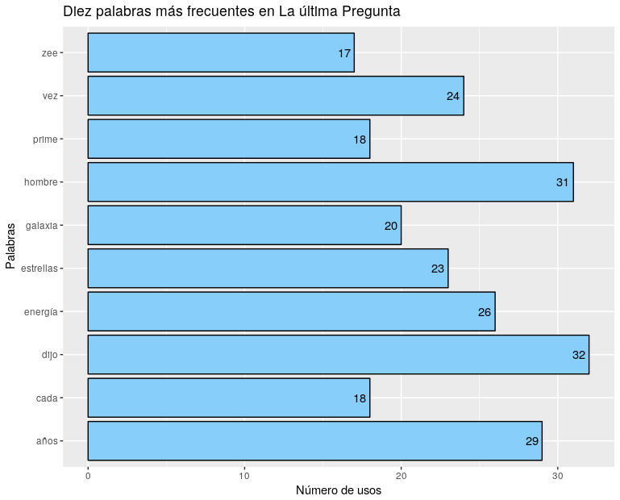

## Análisis de Texto en R

Es importantísimo tener en cuenta que R (ni ningún otro software) es capaz de *hacer* análisis de texto.

En general, usamos software -en el contexto de los análisis de texto- para alguna de las siguientes tareas:

1. Ordenar información.
2. Reducir la cantidad de información.
3. Categorizar.
4. Presentar resultados.

--- .class #id 

## Herramientas a utilizar

### Para esta clase necesitaremos lo siguiente:

1. Una instalación actualizada de R.
2. R Studio u otro software similar (opcional).
3. Conexión a Internet.
4. Una cuenta de [twitter](www.twitter.com).
5. Instalación de los siguientes paquetes de R.
```{r}
install.packages(c("tm", "wordcloud", "readr"))
```

---
## Minería de texto

En general, cuando hablamos de ordenar, clasificar o tabular información de texto, nos referimos a una parte importante de la **minería de texto**.

Kwartler (2017) lo define de esta forma:

> Text mining is the process of distilling actionable insights from text.

Por tanto, es un tipo de análisis **exploratorio** de datos.

--- 
## Un Primer Ejemplo.

Para este primer ejemplo vamos a usar el cuento de Isaac Asimov: "La Última Pregunta" (1956, originalmente *The Last Question*), que pueden encontrar en lols materiales del curso como [lq.txt].

Para leer el documento, nos aseguramos de cargar el paquete adecuado

```{r}
library(readr)
```

Luego, para leer el archivo de texto y vaciar su contenido en un objeto [lq_raw]. Posteriormente, comprobamos los contenidos del objeto:
```{r eval=TRUE}
lq_raw <- read_lines("/home/nitnelav/lq.txt", skip = 2)
str(lq_raw)
```

---
## Creación de una matriz para guardar el texto.
Previamente hemos hablado de lo importante del concepto de *matriz de datos* (Samaja, 1994) en cualquier investigación. Vamos a llevar este argumento a un lugar más literal, creando una matriz.

El primer paso consiste en la creación de una lista de números, que asignaremos a cada línea del texto.
```{r}
diez<-rep(1:ceiling(length(lq_raw)/10), each = 10)
```
Luego, ajustamos la lista al tamaño real de [lq_raw]:
```{r}
diez<-diez[1:length(lq_raw)] 
```
Para luego combinar ambos objetos y darles el tipo de objeto *data frame*.
```{r}
lq_text<-cbind(diez, lq_raw)
lq_text<-as.data.frame(lq_text)
```

---
El siguiente paso es un poco más complejo. Vamos a fusionar los "párrafos artificales" que hemos creado, para que sólo sean una observación (una fila).
```{r}
lq_text<-aggregate(formula = lq_raw ~ diez, data = lq_text, FUN = paste, collapse = " ")

dim(lq_text)
```

Finalmente, transformamos en una matriz, facilitanbdo el trabajo que viene a continuación.

```{r}
lq_mt<-as.matrix(lq_text)

dim(lq_text)
```

---
## Limpieza del texto.
Como estamos trabajando de forma *exploratoria*, es necesario quedarnos sólo con aquello que nos interesa.

```{r}
library(tm)
lq_mt<-gsub("[[:cntrl:]]", " ", lq_mt)
lq_mt<-tolower(lq_mt)
lq_mt<-removeWords(lq_mt, words = stopwords("spanish"))
lq_mt<-removePunctuation(lq_mt)
lq_mt<-stripWhitespace(lq_mt)
```

---
## Creación de un *objeto* de texto.
El siguiente paso es crear un tipo de objeto que R reconozca como texto, en este caso, un objeto de tipo *corpus*.
```{r}
lq_corpus<-Corpus(VectorSource(lq_mt))
lq_corpus
```

---
## La nube de palabras
```{r}
library(wordcloud)

```

---
```{r}
wordcloud(lq_corpus, max.words = 100, random.order = F, 
          colors = brewer.pal(name = "Dark2", n = 8))
```

--- 
## Otro tipo de gráfico.
Podemos tomar la información anterior y presentarla de otra forma.
```{r}
lq_tdm<-TermDocumentMatrix(lq_corpus)
lq_tdm
```

---
A continuación, se convierte el objeto anterior en una matriz y se verifican sus dimensiones (tamaño)
```{r}
lq_mat<-as.matrix(lq_tdm)
dim(lq_mat)
```

---
Luego, se da la estructura necesaria y se crea un *data frame*.
```{r}
lq_mat2<-rowSums(lq_mat)
lq_mat2<-sort(lq_mat2, decreasing = TRUE)
lq_df <- data.frame(palabra = names(lq_mat2), frec = lq_mat2)
```
Para posteriormente aislar las 10 primeras palabras (las más frecuentes):
```{r}
lq_mat3<-lq_df[1:10,]
```

---
## El gráfico de barras.
```{r eval = FALSE}
library(ggplot2)

ggplot(lq_mat3, aes(palabra, frec)) +
  geom_bar(stat = "identity", color = "black", fill = "#87CEFA") +
  geom_text(aes(hjust = 1.3, label = frec)) + 
  coord_flip() + 
  labs(title = "Diez palabras más frecuentes en La última Pregunta",  
       x = "Palabras", y = "Número de usos")
```

---


--- .segue bg:lightgreen
# Obtener datos de Internet

---
## Datos de Twitter
Podría resultar interesante obtener datos de twitter; aprovechar si estructura y analizar de forma parecida a la anterior el texto.

Para ello, se utilizará el siguiente paquete.
```{r eval=FALSE}
install.packages("twitteR")
library(twitteR)
```

---
## Obtención de datos de la cuenta.
Para ello, se debe ingresar a [Twitter Apps](https://apps.twitter.com/) y seleccionar *Create new app*. En la pantalla siguiente, completar los datos, aceptar los términos y crear la app.

</img>

---
Es importantísimo obtener de esta pantalla los datos de *consumer key*. *consumer secret*, *access key* y *access token*.

</img>

---
Para facilitar el proceso, sugiero crear un objeto con cada uno de los componentes.

```{r eval=FALSE}
api_key<-"CONSUMER KEY OBTENIDA EN EL PASO ANTERIOR"
api_secret<-"CONSUMER SECRET DEL PASO ANTERIOR"
token_key<-"ACCESS KEY DEL PASO ANTERIOR"
token_secret<-"ACCESS SECRET DEL PASO ANTERIOR"
```

```{r echo=FALSE}
api_key<-"0PTepmHsqgGKzmPVSYfmh9o7q"
api_secret<-"NsS8erUPqKeWa3nttH5zOaPbwnskHE6OOIlQZz6THvvNrX6mn1"
token_key<-"15371696-ol1RLuVjh6w7AGyk9DDw7HrFRFBp35Ne7NDCr2cNe"
token_secret<-"QnTUUQhBRqMTlZp8uz7dPWj7SNHIQvCmPkkrXTRvrX8IU"
```

Ahora, se ingresa esta información en el paquete **twitteR**.

```{r}
library(twitteR)
setup_twitter_oauth(api_key,api_secret,token_key,token_secret)
```

---
Se les va a pedir seleccionar la forma de autenticar su identidad en twitter, ante lo cual es más conveniente seleccionar la primera opción, directa.

```
[1] "Using direct authentication"
Use a local file ('.httr-oauth'), to cache OAuth access credentials between R sessions?

1: Yes
2: No

Selection: 1
```

---
## Extracción de los tweets y creación del dataframe

A modo de ejemplo, voy a extraer los tweets de mi cuenta.

```{r}
my_tweets<-userTimeline("nitnelav", 3200)
```

Para luego, crear un *dataframe* con la información
```{r}
tw.df<-twListToDF(my_tweets)
```

---
## Preparación de la nube de palabras
```{r}
tw_text<-Corpus(VectorSource(tw.df$text))
```
La limpieza del texto es igual que como lo vimos en el caso del cuento anterior.
```{r}
tw_text<-gsub("[[:cntrl:]]", " ", tw_text)
tw_text<-tolower(tw_text)
tw_text<-removeWords(tw_text, words = stopwords("spanish"))
tw_text<-removePunctuation(tw_text)
tw_text<-removeNumbers(tw_text)
tw_text<-stripWhitespace(tw_text)
```

---
## La nube de palabras.
```{r}
wordcloud(tw_text, max.words = 200, random.order = F, 
          colors = brewer.pal(name = "Dark2", n = 8))
```

--- .segue bg:lightgreen
# ¿Preguntas?