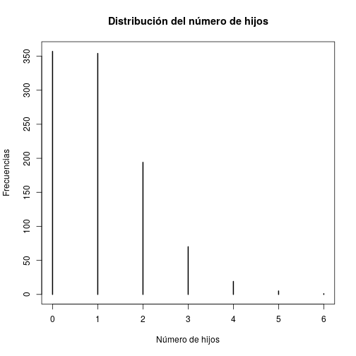

## Estadísticos Descriptivos
Vamos a trabajar con los estadísticos descriptivos básicos que se utilizan usualmente como paso previo en un análisis de datos. Por tanto, no sólo utilizaremos *medidas*, sino que también algunos gráficos y funciones de *subsetting* nque nos permitirán manejar de mejor forma los datos.

Vamos a trabajar con las siguientes medidas:

1. Tendencia Central: moda, mediana y media aritmética.
2. Dispersión: Rango, varianza, desviación estándar.
3. Posición: percentiles.

--- .segue bg:royalblue

# Creación de variables

---
## Variables simuladas.
Vamos a simular algunas variables, para tener control sobre sus atributos:


```r
simulados<-data.frame(id=1:1000,
                      grupo = c(rep("Tratamiento",500), rep("Control", 500)),
                      edad = sample(15:65,1000,replace = TRUE),
                      nhijos = rpois(1000,1.1),
                      iq = rnorm(1000, mean = 100, sd = 15),
                      psu = rnorm(1000, mean = 500, sd = 110),
                      rep_psu = rgeom(1000, 0.8),
                      trabaja = sample(c("Sí", "No"), 1000, replace = TRUE))
```

---
Vamos a verificar la estructura del nuevo *dataframe* creado.

```r
str(simulados)
```

```
## 'data.frame':	1000 obs. of  8 variables:
##  $ id     : int  1 2 3 4 5 6 7 8 9 10 ...
##  $ grupo  : Factor w/ 2 levels "Control","Tratamiento": 2 2 2 2 2 2 2 2 2 2 ...
##  $ edad   : int  24 54 43 24 15 33 54 27 18 55 ...
##  $ nhijos : int  1 1 1 2 2 0 0 0 0 0 ...
##  $ iq     : num  56.6 93 101.1 108.8 120.2 ...
##  $ psu    : num  595 581 325 516 390 ...
##  $ rep_psu: int  0 0 0 0 0 0 0 0 0 0 ...
##  $ trabaja: Factor w/ 2 levels "No","Sí": 2 1 2 1 1 1 1 1 2 1 ...
```

---
También podemos ver las primeras diez observaciones

```r
head(simulados, 10)
```

```
##    id       grupo edad nhijos        iq      psu rep_psu trabaja
## 1   1 Tratamiento   24      1  56.63805 595.0977       0      Sí
## 2   2 Tratamiento   54      1  93.02590 580.8767       0      No
## 3   3 Tratamiento   43      1 101.06454 324.9841       0      Sí
## 4   4 Tratamiento   24      2 108.81656 515.7536       0      No
## 5   5 Tratamiento   15      2 120.21654 389.5970       0      No
## 6   6 Tratamiento   33      0 103.65279 331.7333       0      No
## 7   7 Tratamiento   54      0  81.84668 530.7611       0      No
## 8   8 Tratamiento   27      0 110.11550 365.4292       0      No
## 9   9 Tratamiento   18      0 100.39803 356.1599       0      Sí
## 10 10 Tratamiento   55      0 105.32623 450.8300       0      No
```

---
## Importar datos
Como segundo *dataframe*, vamos a usar los datos de habilidad académica (que ya han trabajado en las asaignaturas de análisis de datos) que están disponibles en INFODA como [BASE.txt].

Dado que es un archivo de texto plano y que no tiene separadores, vamos a usar la función **read.fwf** (*fixed width file*).

```r
habilidad<-read.fwf("./BASE.TXT", widths = c(2,2,2,1,1,1,1,1), 
          col.names = c("id", "aa", "edpad", "motivacion", "evaluacion", 
                        "religion", "sexo", "ubicacion"))
```

---
Luego, convertiremos algunas variables a *factor*.


```r
habilidad$motivacion<-factor(habilidad$motivacion, levels = c(0,1,2), 
                             labels = c("Baja", "Media", "Alta"))

habilidad$evaluacion<-factor(habilidad$evaluacion, levels = c(0,1,2), 
                             labels = c("No ingresa", "Indeciso", "Ingresa"))

habilidad$religion<-factor(habilidad$religion, levels = c(0,1,2), 
                           labels = c("Católico", "Protestante", "Judio"))

habilidad$sexo<-factor(habilidad$sexo, levels = c(0,1), 
                       labels = c("Hombre", "Mujer"))

habilidad$ubicacion<-factor(habilidad$ubicacion, levels = c(0,1), 
                            labels = c("Urbano", "Rural"))
```

---
Para ver un resultado general:

```r
str(habilidad)
```

```
## 'data.frame':	50 obs. of  8 variables:
##  $ id        : int  1 2 3 4 5 6 7 8 9 10 ...
##  $ aa        : int  NA 46 57 94 82 59 61 29 36 91 ...
##  $ edpad     : int  19 12 15 18 13 12 12 9 13 16 ...
##  $ motivacion: Factor w/ 3 levels "Baja","Media",..: 2 1 2 3 3 1 2 1 2 3 ...
##  $ evaluacion: Factor w/ 3 levels "No ingresa","Indeciso",..: 3 1 2 3 2 1 3 1 2 3 ...
##  $ religion  : Factor w/ 3 levels "Católico","Protestante",..: 1 1 1 2 2 3 1 2 1 2 ...
##  $ sexo      : Factor w/ 2 levels "Hombre","Mujer": 1 1 1 2 2 1 1 2 1 2 ...
##  $ ubicacion : Factor w/ 2 levels "Urbano","Rural": 2 1 1 2 2 1 1 1 1 1 ...
```

---
Para ver las primeras 10 observaciones:

```r
head(habilidad, 10)
```

```
##    id aa edpad motivacion evaluacion    religion   sexo ubicacion
## 1   1 NA    19      Media    Ingresa    Católico Hombre     Rural
## 2   2 46    12       Baja No ingresa    Católico Hombre    Urbano
## 3   3 57    15      Media   Indeciso    Católico Hombre    Urbano
## 4   4 94    18       Alta    Ingresa Protestante  Mujer     Rural
## 5   5 82    13       Alta   Indeciso Protestante  Mujer     Rural
## 6   6 59    12       Baja No ingresa       Judio Hombre    Urbano
## 7   7 61    12      Media    Ingresa    Católico Hombre    Urbano
## 8   8 29     9       Baja No ingresa Protestante  Mujer    Urbano
## 9   9 36    13      Media   Indeciso    Católico Hombre    Urbano
## 10 10 91    16       Alta    Ingresa Protestante  Mujer    Urbano
```

--- .segue bg:royalblue
# Descripción de variables

---
## Descripción general
Consideremos los datos simulados. Para una descripción general, utilizamos la función **summary**

```r
summary(simulados)
```

```
##        id                 grupo          edad           nhijos     
##  Min.   :   1.0   Control    :500   Min.   :15.00   Min.   :0.000  
##  1st Qu.: 250.8   Tratamiento:500   1st Qu.:27.00   1st Qu.:0.000  
##  Median : 500.5                     Median :40.00   Median :1.000  
##  Mean   : 500.5                     Mean   :39.83   Mean   :1.059  
##  3rd Qu.: 750.2                     3rd Qu.:52.00   3rd Qu.:2.000  
##  Max.   :1000.0                     Max.   :65.00   Max.   :6.000  
##        iq              psu           rep_psu      trabaja 
##  Min.   : 48.06   Min.   :106.4   Min.   :0.000   No:472  
##  1st Qu.: 89.29   1st Qu.:417.0   1st Qu.:0.000   Sí:528  
##  Median : 99.72   Median :496.5   Median :0.000           
##  Mean   : 99.32   Mean   :490.1   Mean   :0.209           
##  3rd Qu.:108.98   3rd Qu.:559.4   3rd Qu.:0.000           
##  Max.   :148.04   Max.   :816.9   Max.   :5.000
```

--- .segue bg:royalblue
## Medidas de tendencia central.

---
## Media Aritmética.
Para trabajar cualquier variable, se debe considerar que hay que referenciar el *objeto* del *dataframe*, para luego identificar la variable. Por ejemplo, si quisiéramos obtener el promedio de la variable edad en los datos simulados:

```r
mean(simulados$edad)
```

```
## [1] 39.825
```

---
¿Qué pasa si entre los datos hay algún valor perdido (NA para R)?

```r
mean(habilidad$aa)
```

```
## [1] NA
```
Para solucionar esto, agregamos un segundo argumento a la función.

```r
mean(habilidad$aa, na.rm = TRUE)
```

```
## [1] 71
```
Con este argumento, se excluyen del cálculo los casos donde hay valores perdidos.

---
## Mediana
La función **median** permite obtener la mediana; y su funcionamiento es más o menos similar a la media.

```r
median(simulados$edad)
```

```
## [1] 40
```

Para los valores perdidos:

```r
median(habilidad$aa, na.rm = TRUE)
```

```
## [1] 72.5
```

---
## Moda
R no posee una función para calcular directamente la moda, por lo que en caso de necesitarla, podemos obtener las frecuencias de cada categoría, dentro de una variable determinada. Por ejemplo:

```r
table(simulados$nhijos)
```

```
## 
##   0   1   2   3   4   5   6 
## 357 354 194  70  19   5   1
```

```r
table(habilidad$edpad)
```

```
## 
##  9 10 11 12 13 14 15 16 17 18 19 20 
##  3  2  5  9  5  5  5  5  3  2  2  1
```

---
También podemos graficar lo anterior:


```r
plot(table(simulados$nhijos), main = "Distribución del número de hijos",
     xlab = "Número de hijos", ylab = "Frecuencias")
```



--- .segue bg:royalblue
## Medidas de dispersión

---
## Rango
La función **range** entrega los valores mínimo y máximo de una variable

```r
range(simulados$iq)
```

```
## [1]  48.0643 148.0415
```
Al igual que en funciones enteriores, si hay un valor NA, se entrega como resultado NA.

```r
range(habilidad$aa)
```

```
## [1] NA NA
```
La solución, igual que antes:

```r
range(habilidad$aa, na.rm = TRUE)
```

```
## [1] 29 99
```

---
## Varianza.
En este caso, la función **var** es todo lo que necesitamos.

```r
var(simulados$edad)
```

```
## [1] 222.0905
```
Siempre cuidando de atender a los valores perdidos.

```r
var(habilidad$aa, na.rm = TRUE)
```

```
## [1] 305.9149
```

---
## Desviación Estándar.
Sabemos que $de = \sqrt{var}$. Por tanto, podríamos obtener las desviaciones estándar anteriores utilizando la función **sqrt**

```r
sqrt(var(simulados$edad))
```

```
## [1] 14.9027
```
O con una función exclusiva para la desviación estándar.

```r
sd(habilidad$aa, na.rm = TRUE)
```

```
## [1] 17.49042
```

--- .segue bg:royalblue
## Medidas de posición.

---
## Percentiles.
En R, sólo existe la función **quantile**, que nos entrega la siguiente información.

```r
quantile(simulados$edad)
```

```
##   0%  25%  50%  75% 100% 
##   15   27   40   52   65
```
Si nos interesa algo más específico, como por ejemplo el percentil 27, 54 y 81:

```r
quantile(habilidad$aa, probs = c(0.27, 0.54, 0.81), na.rm = TRUE)
```

```
## 27% 54% 81% 
##  59  74  88
```

--- .segue bg:royalblue
# Subsetting

