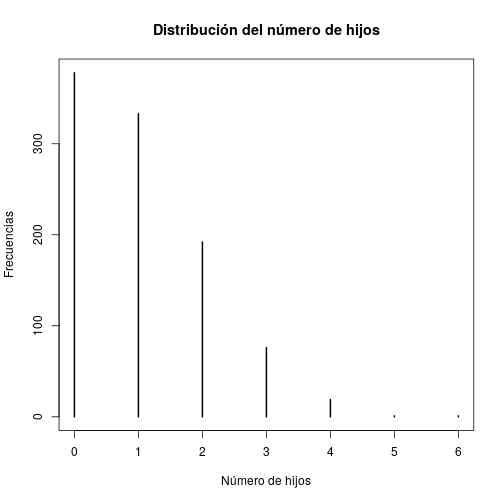

## Estadísticos Descriptivos
Vamos a trabajar con los estadísticos descriptivos básicos que se utilizan usualmente como paso previo en un análisis de datos. Por tanto, no sólo utilizaremos *medidas*, sino que también algunos gráficos y funciones de *subsetting* nque nos permitirán manejar de mejor forma los datos.

Vamos a trabajar con las siguientes medidas:

1. Tendencia Central: moda, mediana y media aritmética.
2. Dispersión: Rango, varianza, desviación estándar.
3. Posición: percentiles.

--- .segue bg:royalblue

# Creación de variables

---
## Variables simuladas.
Vamos a simular algunas variables, para tener control sobre sus atributos:


```r
simulados<-data.frame(id=1:1000,
                      grupo = c(rep("Tratamiento",500), rep("Control", 500)),
                      edad = sample(15:65,1000,replace = TRUE),
                      nhijos = rpois(1000,1.1),
                      iq = rnorm(1000, mean = 100, sd = 15),
                      psu = rnorm(1000, mean = 500, sd = 110),
                      rep_psu = rgeom(1000, 0.8),
                      trabaja = sample(c("Sí", "No"), 1000, replace = TRUE))
```

---
Vamos a verificar la estructura del nuevo *dataframe* creado.

```r
str(simulados)
```

```
## 'data.frame':	1000 obs. of  8 variables:
##  $ id     : int  1 2 3 4 5 6 7 8 9 10 ...
##  $ grupo  : Factor w/ 2 levels "Control","Tratamiento": 2 2 2 2 2 2 2 2 2 2 ...
##  $ edad   : int  49 43 39 36 63 55 58 40 44 41 ...
##  $ nhijos : int  1 2 1 0 2 2 0 0 2 0 ...
##  $ iq     : num  78.8 95.2 106.3 77.9 103.4 ...
##  $ psu    : num  522 453 631 465 609 ...
##  $ rep_psu: int  0 0 0 0 0 0 0 0 0 0 ...
##  $ trabaja: Factor w/ 2 levels "No","Sí": 1 1 2 1 2 1 1 2 1 2 ...
```

---
También podemos ver las primeras diez observaciones

```r
head(simulados, 10)
```

```
##    id       grupo edad nhijos        iq      psu rep_psu trabaja
## 1   1 Tratamiento   49      1  78.80686 521.7601       0      No
## 2   2 Tratamiento   43      2  95.18951 452.8856       0      No
## 3   3 Tratamiento   39      1 106.26767 631.0511       0      Sí
## 4   4 Tratamiento   36      0  77.88706 465.3412       0      No
## 5   5 Tratamiento   63      2 103.40683 608.8420       0      Sí
## 6   6 Tratamiento   55      2  91.28036 606.9076       0      No
## 7   7 Tratamiento   58      0 122.41530 586.7762       0      No
## 8   8 Tratamiento   40      0 105.93485 491.0386       0      Sí
## 9   9 Tratamiento   44      2  81.83454 298.1124       0      No
## 10 10 Tratamiento   41      0 105.59949 685.2019       0      Sí
```

---
## Importar datos
Como segundo *dataframe*, vamos a usar los datos de habilidad académica (que ya han trabajado en las asaignaturas de análisis de datos) que están disponibles en INFODA como [BASE.txt].

Dado que es un archivo de texto plano y que no tiene separadores, vamos a usar la función **read.fwf** (*fixed width file*).

```r
habilidad<-read.fwf("./BASE.TXT", widths = c(2,2,2,1,1,1,1,1), 
          col.names = c("id", "aa", "edpad", "motivacion", "evaluacion", 
                        "religion", "sexo", "ubicacion"))
```

---
Luego, convertiremos algunas variables a *factor*.


```r
habilidad$motivacion<-factor(habilidad$motivacion, levels = c(0,1,2), 
                             labels = c("Baja", "Media", "Alta"))

habilidad$evaluacion<-factor(habilidad$evaluacion, levels = c(0,1,2), 
                             labels = c("No ingresa", "Indeciso", "Ingresa"))

habilidad$religion<-factor(habilidad$religion, levels = c(0,1,2), 
                           labels = c("Católico", "Protestante", "Judio"))

habilidad$sexo<-factor(habilidad$sexo, levels = c(0,1), 
                       labels = c("Hombre", "Mujer"))

habilidad$ubicacion<-factor(habilidad$ubicacion, levels = c(0,1), 
                            labels = c("Urbano", "Rural"))
```

---
Para ver un resultado general:

```r
str(habilidad)
```

```
## 'data.frame':	50 obs. of  8 variables:
##  $ id        : int  1 2 3 4 5 6 7 8 9 10 ...
##  $ aa        : int  NA 46 57 94 82 59 61 29 36 91 ...
##  $ edpad     : int  19 12 15 18 13 12 12 9 13 16 ...
##  $ motivacion: Factor w/ 3 levels "Baja","Media",..: 2 1 2 3 3 1 2 1 2 3 ...
##  $ evaluacion: Factor w/ 3 levels "No ingresa","Indeciso",..: 3 1 2 3 2 1 3 1 2 3 ...
##  $ religion  : Factor w/ 3 levels "Católico","Protestante",..: 1 1 1 2 2 3 1 2 1 2 ...
##  $ sexo      : Factor w/ 2 levels "Hombre","Mujer": 1 1 1 2 2 1 1 2 1 2 ...
##  $ ubicacion : Factor w/ 2 levels "Urbano","Rural": 2 1 1 2 2 1 1 1 1 1 ...
```

---
Para ver las primeras 10 observaciones:

```r
head(habilidad, 10)
```

```
##    id aa edpad motivacion evaluacion    religion   sexo ubicacion
## 1   1 NA    19      Media    Ingresa    Católico Hombre     Rural
## 2   2 46    12       Baja No ingresa    Católico Hombre    Urbano
## 3   3 57    15      Media   Indeciso    Católico Hombre    Urbano
## 4   4 94    18       Alta    Ingresa Protestante  Mujer     Rural
## 5   5 82    13       Alta   Indeciso Protestante  Mujer     Rural
## 6   6 59    12       Baja No ingresa       Judio Hombre    Urbano
## 7   7 61    12      Media    Ingresa    Católico Hombre    Urbano
## 8   8 29     9       Baja No ingresa Protestante  Mujer    Urbano
## 9   9 36    13      Media   Indeciso    Católico Hombre    Urbano
## 10 10 91    16       Alta    Ingresa Protestante  Mujer    Urbano
```

--- .segue bg:royalblue
# Descripción de variables

---
## Descripción general
Consideremos los datos simulados. Para una descripción general, utilizamos la función **summary**

```r
summary(simulados)
```

```
##        id                 grupo          edad           nhijos     
##  Min.   :   1.0   Control    :500   Min.   :15.00   Min.   :0.000  
##  1st Qu.: 250.8   Tratamiento:500   1st Qu.:28.00   1st Qu.:0.000  
##  Median : 500.5                     Median :40.00   Median :1.000  
##  Mean   : 500.5                     Mean   :40.54   Mean   :1.032  
##  3rd Qu.: 750.2                     3rd Qu.:53.00   3rd Qu.:2.000  
##  Max.   :1000.0                     Max.   :65.00   Max.   :6.000  
##        iq              psu           rep_psu      trabaja 
##  Min.   : 51.10   Min.   :188.9   Min.   :0.000   No:516  
##  1st Qu.: 89.64   1st Qu.:432.5   1st Qu.:0.000   Sí:484  
##  Median : 99.84   Median :499.0   Median :0.000           
##  Mean   : 99.64   Mean   :501.4   Mean   :0.256           
##  3rd Qu.:109.93   3rd Qu.:575.2   3rd Qu.:0.000           
##  Max.   :138.19   Max.   :793.2   Max.   :3.000
```

--- .segue bg:royalblue
## Medidas de tendencia central.

---
## Media Aritmética.
Para trabajar cualquier variable, se debe considerar que hay que referenciar el *objeto* del *dataframe*, para luego identificar la variable. Por ejemplo, si quisiéramos obtener el promedio de la variable edad en los datos simulados:

```r
mean(simulados$edad)
```

```
## [1] 40.542
```

---
¿Qué pasa si entre los datos hay algún valor perdido (NA para R)?

```r
mean(habilidad$aa)
```

```
## [1] NA
```
Para solucionar esto, agregamos un segundo argumento a la función.

```r
mean(habilidad$aa, na.rm = TRUE)
```

```
## [1] 71
```
Con este argumento, se excluyen del cálculo los casos donde hay valores perdidos.

---
## Mediana
La función **median** permite obtener la mediana; y su funcionamiento es más o menos similar a la media.

```r
median(simulados$edad)
```

```
## [1] 40
```

Para los valores perdidos:

```r
median(habilidad$aa, na.rm = TRUE)
```

```
## [1] 72.5
```

---
## Moda
R no posee una función para calcular directamente la moda, por lo que en caso de necesitarla, podemos obtener las frecuencias de cada categoría, dentro de una variable determinada. Por ejemplo:

```r
table(simulados$nhijos)
```

```
## 
##   0   1   2   3   4   5   6 
## 378 333 192  76  19   1   1
```

```r
table(habilidad$edpad)
```

```
## 
##  9 10 11 12 13 14 15 16 17 18 19 20 
##  3  2  5  9  5  5  5  5  3  2  2  1
```

---
También podemos graficar lo anterior:


```r
plot(table(simulados$nhijos), main = "Distribución del número de hijos",
     xlab = "Número de hijos", ylab = "Frecuencias")
```



--- .segue bg:royalblue
## Medidas de dispersión

---
## Rango
La función **range** entrega los valores mínimo y máximo de una variable

```r
range(simulados$iq)
```

```
## [1]  51.10007 138.18878
```
Al igual que en funciones enteriores, si hay un valor NA, se entrega como resultado NA.

```r
range(habilidad$aa)
```

```
## [1] NA NA
```
La solución, igual que antes:

```r
range(habilidad$aa, na.rm = TRUE)
```

```
## [1] 29 99
```

---
## Varianza.
En este caso, la función **var** es todo lo que necesitamos.

```r
var(simulados$edad)
```

```
## [1] 217.9282
```
Siempre cuidando de atender a los valores perdidos.

```r
var(habilidad$aa, na.rm = TRUE)
```

```
## [1] 305.9149
```

---
## Desviación Estándar.
Sabemos que $de = \sqrt{var}$. Por tanto, podríamos obtener las desviaciones estándar anteriores utilizando la función **sqrt**

```r
sqrt(var(simulados$edad))
```

```
## [1] 14.76239
```
O con una función exclusiva para la desviación estándar.

```r
sd(habilidad$aa, na.rm = TRUE)
```

```
## [1] 17.49042
```

--- .segue bg:royalblue
## Medidas de posición.

---
## Percentiles.
En R, sólo existe la función **quantile**, que nos entrega la siguiente información.

```r
quantile(simulados$edad)
```

```
##   0%  25%  50%  75% 100% 
##   15   28   40   53   65
```
Si nos interesa algo más específico, como por ejemplo el percentil 27, 54 y 81:

```r
quantile(habilidad$aa, probs = c(0.27, 0.54, 0.81), na.rm = TRUE)
```

```
## 27% 54% 81% 
##  59  74  88
```

--- .segue bg:royalblue
# Subsetting

---
## Funciones en distintos *niveles* de un factor.
R tiene varias formas de reportar alguna función y aplicarla a distintos niveles de una variable. En el caso de los datos simulados, si por ejemplo, interesa obtener el promedio de edad entre el grupo control y el grupo tratamiento:

```r
tapply(simulados$edad, simulados$grupo, mean)
```

```
##     Control Tratamiento 
##      40.904      40.180
```
Con las mismas consideraciones para los valores perdidos:

```r
tapply(habilidad$aa, habilidad$sexo, mean, na.rm = TRUE)
```

```
##   Hombre    Mujer 
## 69.92593 72.38095
```

---
## Otra formas de hacer lo mismo.
La función **tapply** es parte de la "familia" de funciones **apply**, cuya estructura se asemeja mucho a otros lenguajes como Python. Existen otras alternativas, con nombres más *intuitivos*, pero que en esencia hacen lo mismo.

```r
by(habilidad$aa, habilidad$sexo, mean, na.rm = TRUE)
```

```
## habilidad$sexo: Hombre
## [1] 69.92593
## -------------------------------------------------------- 
## habilidad$sexo: Mujer
## [1] 72.38095
```
Noten que el tercer argumento de esta función y de **tapply** es otra función, la que se quiere aplicar a todos los niveles del segundo argumento. Por tanto, no sólo sirve para la media, sino para casi todo lo que hemos visto previamente.

---
## Escribiéndolo de manera más complicada.
Se puede usar la estructura de *subsetting* para considerar sólo una parte de los datos. Por ejemplo, si nos interesa únicamente el promedio de aa de los hombres.

```r
mean(habilidad$aa[habilidad$sexo=="Hombre"], na.rm = TRUE)
```

```
## [1] 69.92593
```
Luego, si queremos conocer la desviación estándar, en la misma variable, pero para las mujeres:

```r
sd(habilidad$aa[habilidad$sexo=="Mujer"], na.rm = TRUE)
```

```
## [1] 18.02353
```

---
## Utilizar fórmulas.
Algunas funciones nos piden como primer argumento una fórmula, con la siguiente estructura:
$$ Y \sim X$$
donde $Y$ es una variable numérica y $X$ es un factor. La virgulilla se hace con la tecla Alt derecha + 4.

El mismo ejemplo anterior:

```r
aggregate(habilidad$aa ~ habilidad$sexo, FUN = mean, na.rm=TRUE)
```

```
##   habilidad$sexo habilidad$aa
## 1         Hombre     69.92593
## 2          Mujer     72.38095
```

---
## Graficando.


```r
boxplot(habilidad$aa~habilidad$sexo, na.rm=TRUE)
```


---
## Opciones graficas.

```r
boxplot(habilidad$aa~habilidad$sexo, na.rm=TRUE, main = "Puntajes de AA, por sexo.",
        ylab = "Puntaje AA", col = c("gold", "blue"))
```


--- .segue bg:royalblue
# Incorporando paquetes.

---
## Descriptivos, con psych
En caso de necesitar varios descriptivos al mismo tiempo, podríamos escribir una función que automatice el proceso, o bien instalar un paquete que la incluya.

```r
install.packages("psych", repos = 'https://dirichlet.mat.puc.cl/')
```

```
## Installing package into '/usr/local/lib/R/site-library'
## (as 'lib' is unspecified)
```

```r
library(psych)
```
Probemos la función **describe** con la variable edpad del dataframe [habilidad]

```r
describe(habilidad$edpad)
```

```
##    vars  n  mean  sd median trimmed  mad min max range skew kurtosis   se
## X1    1 47 13.72 2.8     13   13.64 2.97   9  20    11  0.3    -0.74 0.41
```

---
Podemos agregar como argumento únicamente el nombre del *dataframe*, para que nos entregue los descriptivos de topdas las variables.

```r
describe(simulados)
```

```
##          vars    n   mean     sd median trimmed    mad    min     max
## id          1 1000 500.50 288.82 500.50  500.50 370.65   1.00 1000.00
## grupo*      2 1000   1.50   0.50   1.50    1.50   0.74   1.00    2.00
## edad        3 1000  40.54  14.76  40.00   40.57  19.27  15.00   65.00
## nhijos      4 1000   1.03   1.04   1.00    0.89   1.48   0.00    6.00
## iq          5 1000  99.64  14.70  99.84   99.71  15.01  51.10  138.19
## psu         6 1000 501.43 105.00 498.97  501.63 105.10 188.88  793.25
## rep_psu     7 1000   0.26   0.58   0.00    0.12   0.00   0.00    3.00
## trabaja*    8 1000   1.48   0.50   1.00    1.48   0.00   1.00    2.00
##           range  skew kurtosis   se
## id       999.00  0.00    -1.20 9.13
## grupo*     1.00  0.00    -2.00 0.02
## edad      50.00  0.00    -1.21 0.47
## nhijos     6.00  0.90     0.45 0.03
## iq        87.09 -0.05    -0.21 0.46
## psu      604.37  0.01    -0.13 3.32
## rep_psu    3.00  2.45     5.94 0.02
## trabaja*   1.00  0.06    -2.00 0.02
```

--- .segue bg:royalblue
# ¿Preguntas?
