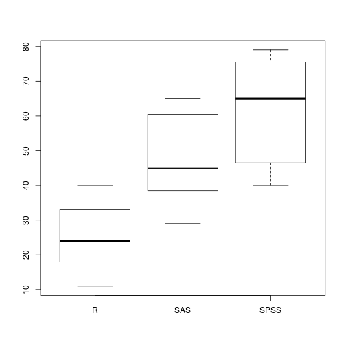

## Datos simulados: fumadores
Vamos a simular datos sobre la edad de muerte de un grupo de 35 personas, jun to con optras características relevantes.

```r
fumadores<-data.frame(id = 1:36,
                edad_muerte = c(sample(70:90,18,replace = TRUE), sample(60:80, 18, 
                replace = TRUE)),
                fuma = c(rep("No", 18), rep("Sí",18)),
                sexo = sample(c("Hombre", "Mujer"), 36, replace = TRUE))
head(fumadores, 5)
```

```
##   id edad_muerte fuma   sexo
## 1  1          85   No  Mujer
## 2  2          85   No Hombre
## 3  3          87   No Hombre
## 4  4          76   No  Mujer
## 5  5          82   No  Mujer
```

---
## Datos simulados: bebedores
Simularemos ahora los datos sobre la cantidad de tragos por semana que bebían 2581 personas antes y después de un experimento en el que se les sometía a un programa de erducación sobrer los efectos del alcohol. Se midió también su editorial preferida de comics.

```r
bebedores<-data.frame(id = 1:2581,
                editorial = sample(c("Marvel", "DC"), 2581, replace = TRUE),
                grupo = c(rep("Tratamiento", 1200), rep("Control", 1381)),
                tragos_pre = rpois(2581,10),
                tragos_post = c(rpois(1200, 7), rpois(1381,10)))
head(bebedores,5)
```

```
##   id editorial       grupo tragos_pre tragos_post
## 1  1        DC Tratamiento         16           9
## 2  2    Marvel Tratamiento         15          10
## 3  3    Marvel Tratamiento          4           6
## 4  4    Marvel Tratamiento         12           7
## 5  5        DC Tratamiento          8           6
```

---
## Datos simulados para ANOVA.
Se recolectaron datos para 60 usuarios de software estadístico. Se registraron escalas de facilidad de uso, flexibilidad de análisis y actualización de procedimientos.


```r
software<-data.frame(id = 1:60,
                     software = c(rep("R", 20), rep("SAS", 20), rep("SPSS", 20)),
                     facilidad = c(sample(10:40, 20, replace = T), 
                        sample(25:65, 20, replace = T), sample(40:80, 20, replace = T)),
                     flexibilidad = c(sample(50:85, 20, replace = T), 
                        sample(30:60, 20, replace = T), sample(10:35, 20, replace = T)),
                     actualizacion = c(sample(50:100, 20, replace = T), 
                        sample(20:60, 20, replace = T), sample(20:60, 20, replace = T)))
```

---
Para comprobar el dataframe creado:

```r
str(software)
```

```
## 'data.frame':	60 obs. of  5 variables:
##  $ id           : int  1 2 3 4 5 6 7 8 9 10 ...
##  $ software     : Factor w/ 3 levels "R","SAS","SPSS": 1 1 1 1 1 1 1 1 1 1 ...
##  $ facilidad    : int  27 31 23 36 17 30 11 23 23 38 ...
##  $ flexibilidad : int  65 70 83 61 73 76 57 65 69 63 ...
##  $ actualizacion: int  62 84 69 54 86 100 85 71 77 77 ...
```

---
## Datos reales: Simce 2016
Leeremos el archivop [simce4_2016.xlsx], que pueden descargar de INFODA. Son los datos reales, para cada establecimiento, de sus puntajes para 4º Básico en Lectura y Matemática, además de otras variables.

```r
library(readxl)
simce<-read_excel("./simce4_2016.xlsx")

simce$dependencia<-factor(simce$dependencia, levels = c(1,2,3),
                    labels = c("Municipal", "Particular Subvencionado", "Particular"))

simce$gse<-factor(simce$gse, levels = c(1,2,3,4,5),
                  labels = c("Bajo", "Medio Bajo", "Medio", "Medio Alto", "Alto"))

simce$rural<-factor(simce$rural, levels = c(1,2),
                    labels = c("Urbano", "Rural"))
```

---
Posteriormente, comprobamos las variables recodificadas:

```r
head(simce)
```

```
## # A tibble: 6 x 10
##     rbd region comuna dependencia        gse  rural nalu_lect nalu_mat
##   <dbl>  <dbl>  <chr>      <fctr>     <fctr> <fctr>     <dbl>    <dbl>
## 1     5     15  ARICA   Municipal      Medio Urbano        26       28
## 2     8     15  ARICA   Municipal Medio Bajo Urbano         2        2
## 3     9     15  ARICA   Municipal      Medio Urbano        26       28
## 4    10     15  ARICA   Municipal Medio Bajo Urbano         2        2
## 5    11     15  ARICA   Municipal Medio Bajo Urbano         2        2
## 6    12     15  ARICA   Municipal Medio Bajo Urbano        26       28
## # ... with 2 more variables: lect <dbl>, mat <dbl>
```

--- .segue bg:royalblue
# Diferencias de dos medias

--- .segue bg:royalblue
## Muestras independientes.

---
## Supuestos.

### Variable dependiente normalmente distribuida
Asumimos que la variable dependiente tiene una distribución **similar** a la normal en ambos niveles de la variable independiente. A pesar de esto, la prueba T es robusta para desviaciones de la distribución normal, únicamente si se garantiza que:
$$ \frac{n_{mayor}}{n_{menor}} \leq 1,5$$

### Homocedasticidad.
Las varianzas de ambos grupos son iguales. En caso de no cumplirse este supuesto, se pueden hacer algunas correcciones que vienen  incluidas en la función del test.

---
## Error Estándar.
Recordemos que para la variable aleatoria $X$, la **varianza de su distribución de muestreo** equivale a:
$$ \hat{\sigma}^{2}_{\overline{X}} = \frac{\sigma^{2}}{n}$$
De esta forma, la diferencia entre dos grupos tiene el siguiente **error estándar**
$$ \hat{\sigma}_{\overline{X}_{2}- \overline{X}_{1}} =  \sqrt{\hat{\sigma}^{2}_{\overline{X}}} = \sqrt{\frac{\sigma^{2}_{1}}{n_{1}} + \frac{\sigma^{2}_{2}}{n_{2}}}$$
Estas medidas son relevantes para construir los **intervalos de confianza**.

---
## Ejemplo: fumadores
### Verificando supuestos.
Para conocer si una variable distribuye normal, utilizaremos el test *shapiro-wilk*

```r
shapiro.test(fumadores$edad_muerte)
```

```
## 
## 	Shapiro-Wilk normality test
## 
## data:  fumadores$edad_muerte
## W = 0.94279, p-value = 0.06209
```
La variable aparentemente es normal, pero debemos asegurarnos que lo sea para cada **nivel** de la variable [fuma]

---


```r
tapply(fumadores$edad_muerte, fumadores$fuma, shapiro.test)
```

```
## $No
## 
## 	Shapiro-Wilk normality test
## 
## data:  X[[i]]
## W = 0.91635, p-value = 0.1114
## 
## 
## $Sí
## 
## 	Shapiro-Wilk normality test
## 
## data:  X[[i]]
## W = 0.89792, p-value = 0.05287
```

---
Si no obtenemos normalidad, podemos verificar el *ratio* entre el $n$ de ambos grupos:

```r
length(fumadores$fuma[fumadores$fuma=="Sí"])/length(fumadores$fuma[fumadores$fuma=="No"])
```

```
## [1] 1
```

### Homocedasticidad.
Para verificar este supuesto, utilizamos la prueba de Bartlett, cuya hipótesis nula es:
$$ H_{0}: \; \sigma^{2}_{fuma} - \sigma^{2}_{no\;  fuma} = 0 $$

```r
bartlett.test(fumadores$edad_muerte~fumadores$fuma)
```

```
## 
## 	Bartlett test of homogeneity of variances
## 
## data:  fumadores$edad_muerte by fumadores$fuma
## Bartlett's K-squared = 1.7797, df = 1, p-value = 0.1822
```

---
## T-test
La hipótesis nula es:
$$ H_{0}: \; \overline{Y}_{fuma} - \overline{Y}_{no\;  fuma} = 0 $$
Veamos primero los promedios de edad de muerte para ambos grupos:

```r
tapply(fumadores$edad_muerte, fumadores$fuma, mean)
```

```
##       No       Sí 
## 79.44444 68.61111
```
Al parecer, la diferencia no es cero.

---
Probemos que esta diferencia efectivamente es distinta de cero.

```r
t.test(edad_muerte~fuma, data = fumadores, var.equal=TRUE)
```

```
## 
## 	Two Sample t-test
## 
## data:  edad_muerte by fuma
## t = 5.2667, df = 34, p-value = 7.741e-06
## alternative hypothesis: true difference in means is not equal to 0
## 95 percent confidence interval:
##   6.653071 15.013596
## sample estimates:
## mean in group No mean in group Sí 
##         79.44444         68.61111
```

---
## Alternativa no-paramétrica.
Si no logramos cumplir el primer supuesto, ya sea porque la variable no distribuye normal, o porquer la razón entre el tamaño de ambos grupos es mayor a 1,5; se puede utilizar una prueba no-paramétrica.

La prueba de Mann Whitney compara **medianas** con la siguiente hipótesis nula:
$$ H_{0}: \; Y_{fuma} - Y_{no\;  fuma} = 0 $$

---
La función en R:


```r
wilcox.test(edad_muerte~fuma, data=fumadores)
```

```
## Warning in wilcox.test.default(x = c(85L, 85L, 87L, 76L, 82L, 86L, 78L, :
## cannot compute exact p-value with ties
```

```
## 
## 	Wilcoxon rank sum test with continuity correction
## 
## data:  edad_muerte by fuma
## W = 281, p-value = 0.0001734
## alternative hypothesis: true location shift is not equal to 0
```

--- .segue bg:royalblue
## Muestras dependientes

---
## Lógica experimental.
Una prueba de diferencia de medias para **muestras dependientes** considera una lógica experimental, dado que compara a cada individuo consigo mismo en un tiempo previo. Considere una variable aleatoria $X$ en un tiempo $t$ (medición final), lo que se estima es la siguiente diferencia.
$$ \overline{X}_{t} - \overline{X}_{t-1} $$
Obviamente, se puede estimar una diferencia con un *lag* mayor a 1, pero como se trata de diferencias de dos medias, siempre se trabajará con dos puntos temporales.

---
## La función en R.
Consideremos el dataframe [bebedores], que simula los resultados de un tratamiento que busca disminuir la cantidad de tragos por semana de un grupo de personas. Debemos asegurarnos que al inicio, los grupos estén balanceados:

```r
t.test(tragos_pre~grupo, data = bebedores)
```

```
## 
## 	Welch Two Sample t-test
## 
## data:  tragos_pre by grupo
## t = -0.19854, df = 2508.3, p-value = 0.8426
## alternative hypothesis: true difference in means is not equal to 0
## 95 percent confidence interval:
##  -0.2721842  0.2221347
## sample estimates:
##     mean in group Control mean in group Tratamiento 
##                  9.884142                  9.909167
```

---
Noten que acabamos de hacer una prueba de muestras **independientes**, que arrojó que al comienzo del experimento, los grupos están balanceados. Veamos ahora sí en términos generales, existe un efecto del tratamiento en la cantidad de tragos por semana.

```r
t.test(bebedores$tragos_post,bebedores$tragos_pre, paired = TRUE)
```

```
## 
## 	Paired t-test
## 
## data:  bebedores$tragos_post and bebedores$tragos_pre
## t = -15.456, df = 2580, p-value < 2.2e-16
## alternative hypothesis: true difference in means is not equal to 0
## 95 percent confidence interval:
##  -1.576133 -1.221232
## sample estimates:
## mean of the differences 
##               -1.398683
```

---
Los resultados indican que en promedio, el tratamiento hace que la población **general** disminuya en 1,3 tragos por semana. 

Si se quiere, una interpretación de los resultados que utilice el intervalo de confianza, es que la población general disminuye entre **1,5** y **1,2** tragos por semana.

Podemos ser más específicos, replanteando la hipótesis alternativa, si tenemos evidencia suficiente para postular una hipótesis **direccional**. En este caso:
$$ H_{0}:\; \overline{Y}_{POST} - \overline{Y}_{PRE} = 0$$
$$ H_{0}:\; \overline{Y}_{POST} - \overline{Y}_{PRE} < 0$$

---
Esta hipótesis se ve reflejada en la función:

```r
t.test(bebedores$tragos_post, bebedores$tragos_pre, paired = TRUE, alternative = "less")
```

```
## 
## 	Paired t-test
## 
## data:  bebedores$tragos_post and bebedores$tragos_pre
## t = -15.456, df = 2580, p-value < 2.2e-16
## alternative hypothesis: true difference in means is less than 0
## 95 percent confidence interval:
##       -Inf -1.249778
## sample estimates:
## mean of the differences 
##               -1.398683
```
Este resultado indica que la diferencia entre los tragos pre y post es como mínimo 1,2. Dicho de otra forma, en promedio, el tratamiento disminuye **como mínimo en 1,2** tragos por semana.

---
## Alternativa no-paramétrica.
La función es similar que para muestras independientes, sólo que se agrega el argumento *paired*.

```r
wilcox.test(bebedores$tragos_post, bebedores$tragos_pre, paired = TRUE)
```

```
## 
## 	Wilcoxon signed rank test with continuity correction
## 
## data:  bebedores$tragos_post and bebedores$tragos_pre
## V = 914940, p-value < 2.2e-16
## alternative hypothesis: true location shift is not equal to 0
```
Este resultado muestra una diferencia **estadísticamente significativa** entre la medición pre y la medición post. Como se observa, la conclusión es menos precisa, pero esto se compensa con que las ocasiones en que se aplica esta prueba son mucho más **restrictivas** que cuando se utiliza la alternativa paramétrica.

--- .segue bg:royalblue
# Diferencias entre $k$ medias.

---
## Una idea relevante.
Si queremos comparar los valores promedio de los $k$ niveles de una variable $Y$, **¿por qué no hacemos $\binom{k}{2}$ comparaciones utilizando pruebas T?**

Supongamnos el caso más simple, una variable con tres niveles:
$$ x \in \{x_{1}, x_{2}, x_{3} \}$$

Podríamos hacer las siguientes comparaciones:

* $H_{0}: \; \overline{X}_{1} - \overline{X}_{2} = 0$
* $H_{0}: \; \overline{X}_{2} - \overline{X}_{3} = 0$
* $H_{0}: \; \overline{X}_{1} - \overline{X}_{3} = 0$

---
## El problema dsel enfoque anterior.
Si cada una de estas comparaciones se realiza con un **95%** de confianza; y asumimos que son independientes entre sí, el nivel de confianza de la prueba será:
$$ 0,95 \times 0,95 \times  0,95 = 0,95^3 = 0,857375$$

Por tanto, la probabilidad de cometer un **error tipo I** es:
$$ 1 - 0,95^3 = 0,142625 $$

De esta forma, si hacemos comparaciones múltiples, en lugar de trabajar con un máximo de 5% de rechazar kla hipótesis nula, trabajamos con un 14,26%.

--- 
## Supuestos de la prueba de análisis de varianza.
### Homocedasticidad
Al igual que para dos medias, se puede verificar este supuesto con una prueba de Bartlett.

```r
bartlett.test(software$facilidad, software$software)
```

```
## 
## 	Bartlett test of homogeneity of variances
## 
## data:  software$facilidad and software$software
## Bartlett's K-squared = 4.7845, df = 2, p-value = 0.09142
```

---
### Las distribuciones de la variable dependiente para los $k$ grupos son normales.

```r
by(software$facilidad, software$software, shapiro.test)
```

```
## software$software: R
## 
## 	Shapiro-Wilk normality test
## 
## data:  dd[x, ]
## W = 0.95679, p-value = 0.4819
## 
## -------------------------------------------------------- 
## software$software: SAS
## 
## 	Shapiro-Wilk normality test
## 
## data:  dd[x, ]
## W = 0.90106, p-value = 0.04316
## 
## -------------------------------------------------------- 
## software$software: SPSS
## 
## 	Shapiro-Wilk normality test
## 
## data:  dd[x, ]
## W = 0.86642, p-value = 0.01017
```

---
## La prueba ANOVA.
Consideremos el mismo ejemplo anterior, cuya hipótesis nula es:
$$H_{0}: \; \overline{Y}_{R} = \overline{Y}_{SAS} = \overline{Y}_{SPSS}$$
Para facilitar el proceso, crearemos un objeto [anova1] con los resultados de la comparación.

```r
anova1<-aov(facilidad~software, data = software)

summary(anova1)
```

```
##             Df Sum Sq Mean Sq F value   Pr(>F)    
## software     2  12981    6491   45.84 1.36e-12 ***
## Residuals   57   8071     142                     
## ---
## Signif. codes:  0 '***' 0.001 '**' 0.01 '*' 0.05 '.' 0.1 ' ' 1
```

---
## ¿Dónde están las diferencias?
Se pueden hacer comparaciones múltipes con la siguiente función:

```r
TukeyHSD(anova1)
```

```
##   Tukey multiple comparisons of means
##     95% family-wise confidence level
## 
## Fit: aov(formula = facilidad ~ software, data = software)
## 
## $software
##           diff       lwr     upr     p adj
## SAS-R    22.85 13.795095 31.9049 0.0000003
## SPSS-R   35.55 26.495095 44.6049 0.0000000
## SPSS-SAS 12.70  3.645095 21.7549 0.0037584
```

---
O bien, se puede observar gráficamente.

```r
boxplot(software$facilidad~software$software)
```



--- .segue bg:royalblue
## Cuando no se cumplen los supuestos.

---
## Heterocedasticidad.
En caso de haber obtenido varianzas que no son iguales en la prueba de Bartlett, se puede utilizar la prueba F de Welch.

```r
oneway.test(facilidad~software, data = software)
```

```
## 
## 	One-way analysis of means (not assuming equal variances)
## 
## data:  facilidad and software
## F = 52.798, num df = 2.000, denom df = 36.303, p-value = 1.793e-11
```

----
## Distribución normal de las variables
Si no se cumple este supuesto, podemos usar la prueba no-paramétrica de **Kruskal-Wallis**

```r
kruskal.test(facilidad~software, data = software)
```

```
## 
## 	Kruskal-Wallis rank sum test
## 
## data:  facilidad by software
## Kruskal-Wallis chi-squared = 39.446, df = 2, p-value = 2.719e-09
```

--- .segue bg:royalblue
# ¿Preguntas?
